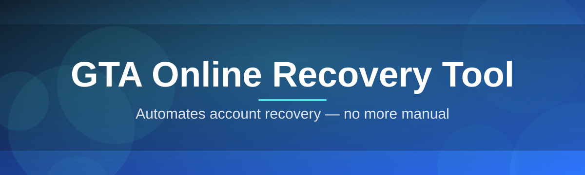
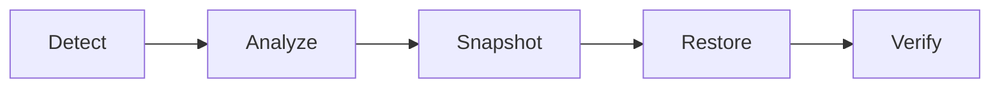

# gta-online-recovery-tool 🎮🛠️

  

*Get your Rockstar account state back in order — no drama, no guesswork.*

  

---

## 📡 Overview

Losing progress in GTA Online hurts. Modified stats, corrupted cloud saves, mysterious rollbacks, or a locked account after a routine save-sync error — the pain is real, and Rockstar's own support queue moves at the speed of a Molotov cocktail traveling through mud. **gta-online-recovery-tool** exists to close that gap: a focused, standalone Windows utility built to diagnose, back up, and restore your GTA Online profile data so a bad night doesn't erase months of grinding.

This isn't a mod menu, a stat editor, or anything that touches game servers mid-session. It's a recovery-first utility — think of it as a black box flight recorder for your save state. It inspects local cloud-sync caches, validates profile integrity, and gives you a clean path back to a known-good state when Rockstar's own systems fall short. Built for players who've felt the sting of a wiped garage or a vanished Cayo Perico stash and never want to feel it twice.

Who's this for? Long-time grinders managing multiple characters, casual players who just want peace of mind before a big update drops, and community moderators who field "I lost everything" tickets daily. If you've ever Googled "GTA Online save recovery" at 2 AM, this tool was built with you in mind.

  

> [!TIP]
> Run a backup snapshot **before** every major GTA Online title update. Rockstar's patch-day sync issues are the #1 cause of support tickets — a snapshot turns a disaster into a two-minute restore.

---

## 🧩 What It Actually Does

- **Profile Snapshotting** — captures a point-in-time image of your local GTA Online profile cache so you always have a fallback, not just hope.

- **Integrity Scanning** — walks through save metadata looking for the telltale fingerprints of desync, truncation, or corrupted headers before they cost you a session.

- **Guided Restore Wizard** — a linear, no-jargon flow that walks you from "something's wrong" to "back in Los Santos" without touching a config file by hand.

- **Multi-Character Awareness** — treats each character slot independently, so restoring one doesn't silently overwrite the others.

- **Rollback Detection** — flags suspicious downgrades in cash, RP, or inventory state that match known rollback patterns, so you know *what* changed before you act.

- **Offline-First Design** — everything runs locally against your own files; nothing is uploaded, nothing phones home.

- **Audit Log Export** — every scan and restore action gets logged to a plain-text file, handy when you need to show Rockstar Support exactly what happened.

- **One-Click Snapshot Scheduling** — set it once, forget it, and let the tool quietly keep fresh recovery points on a schedule you define.

---

## 🚀 How To Get Started

> [!NOTE]
> Total setup time: under three minutes. No accounts, no sign-ups, no dependencies to chase down.

1. **Visit the landing page** using the download button above or below — it's the only official source for the tool.

2. **Download the standalone executable.** There's nothing else to fetch; it's a single self-contained file.

3. **Run it.** Windows may show a first-run SmartScreen prompt for unrecognized publishers — click "More info" then "Run anyway."

4. **Take your first snapshot** immediately, even if nothing's wrong yet. That snapshot is your insurance policy for tomorrow.

---

## 💻 System Requirements

| Requirement | Details |
|---|---|
| OS | Windows 10 (64-bit) or Windows 11 |
| Disk Space | ~150 MB free for snapshots and logs |
| Dependencies | None — fully standalone binary |
| Internet | Not required for core recovery functions |
| Permissions | Standard user; admin only needed for some restore paths |

  

---

## ⚙️ How It Works

The tool follows a deliberately simple, linear pipeline — no hidden background processes, no silent writes.

1. **Detect** — locates your GTA Online profile cache on disk.
2. **Analyze** — scans structure and metadata for known corruption signatures.
3. **Snapshot** — stores a compressed, timestamped backup locally.
4. **Restore** — if needed, replays a chosen snapshot back into place.
5. **Verify** — re-checks integrity post-restore before you relaunch the game.

> [!IMPORTANT]
> Always close GTA Online and the Rockstar launcher before running a restore. Writing over an actively locked save file is the single most common cause of a failed recovery.

---

## 🧯 Troubleshooting

**Q: The tool says my profile cache wasn't found. Why?**
A: Your install path may be non-default, or the launcher hasn't synced yet. Launch the game once, let it fully load into Freemode, then close it and retry.

**Q: My restore completed but the game still shows old stats.**
A: The Rockstar cloud sync may be overwriting your local restore on next launch. Temporarily switch to offline/story mode first, confirm the local state, then reconnect.

**Q: SmartScreen is blocking the executable.**
A: This happens with new, low-download-count binaries — it's a Windows heuristic, not a integrity signal. Click "More info" → "Run anyway," or verify the file hash on the landing page.

**Q: Can this tool fix a suspension or ban?**
A: No. It only manages local save and cache data. Account moderation issues must go through Rockstar Support directly.

**Q: How many snapshots should I keep?**
A: We recommend at least three rolling snapshots — pre-update, weekly, and "just before something risky."

**Q: Does this modify online stats or currency?**
A: Never. It restores *your own* previous legitimate state — it does not create, inflate, or fabricate anything.

---

## 🎨 UI / UX Details

<strong>Keyboard Shortcuts</strong>

| Shortcut | Action |
|---|---|
| `Ctrl + S` | Take snapshot now |
| `Ctrl + R` | Open Restore Wizard |
| `Ctrl + L` | Open audit log |
| `F5` | Refresh profile scan |
| `Esc` | Cancel current operation |

<strong>Themes & Settings</strong>

- Light and Dark themes, auto-switching with Windows system theme

- Adjustable snapshot retention count (3 / 5 / 10 / unlimited)

- Optional desktop notification on scheduled snapshot completion

- Compact mode for smaller displays

> [!TIP]
> Enable **Compact Mode** in Settings if you're running the tool alongside the game on a single-monitor setup.

---

## 🤝 Contributing & Community

Bug reports, feature requests, and pull requests are welcome. Before opening an issue:

- Search existing issues to avoid duplicates.

- Include your Windows build number and a snippet from the audit log.

- Keep feature requests focused on *recovery*, not gameplay modification — that's a hard boundary for this project.

> [!WARNING]
> Pull requests that introduce network calls to third-party or unofficial servers will be closed without review. This project's trust model depends on staying strictly local and offline-first.

---

## 📜 License

Released under the [MIT License](LICENSE), 2026. Use it, fork it, learn from it — just keep the license notice intact.

---

## ⚠️ Disclaimer

This tool is an independent, community-built utility and is not affiliated with, endorsed by, or connected to Rockstar Games or Take-Two Interactive. It interacts only with locally stored profile and cache data. Use of this tool does not guarantee restoration in every scenario, and users are responsible for complying with Rockstar's Terms of Service. Always maintain your own backups.

  

